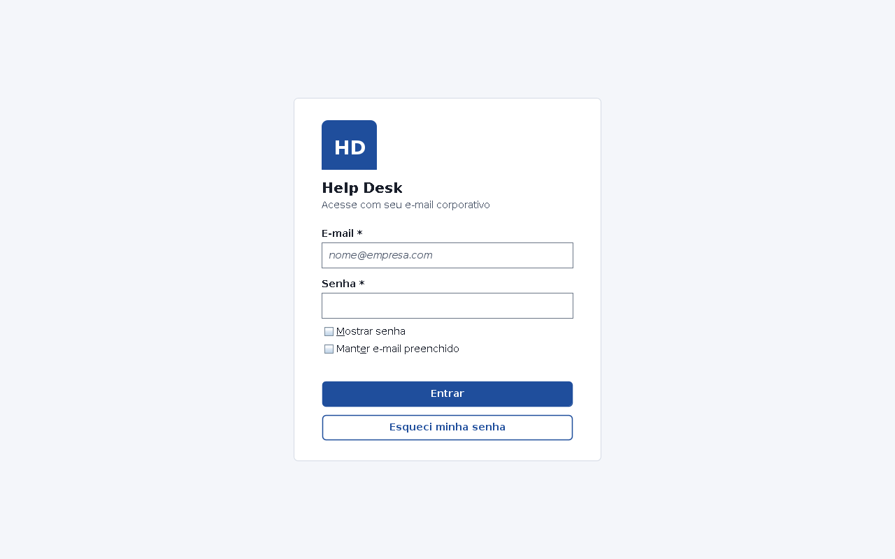
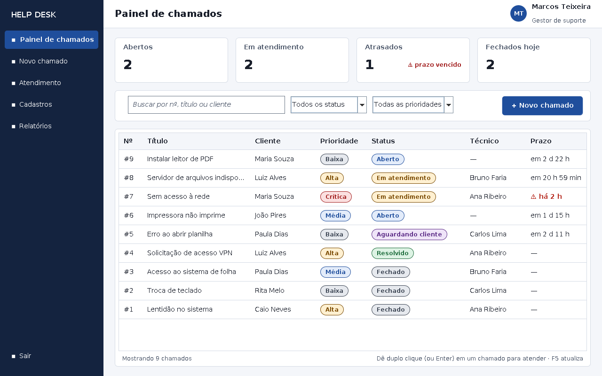
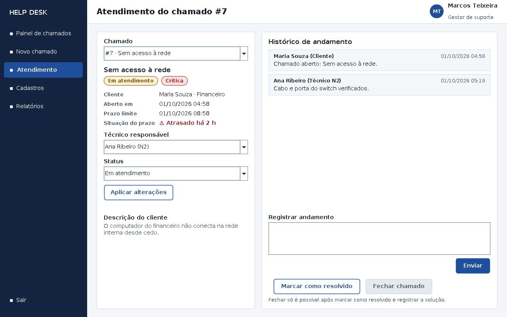
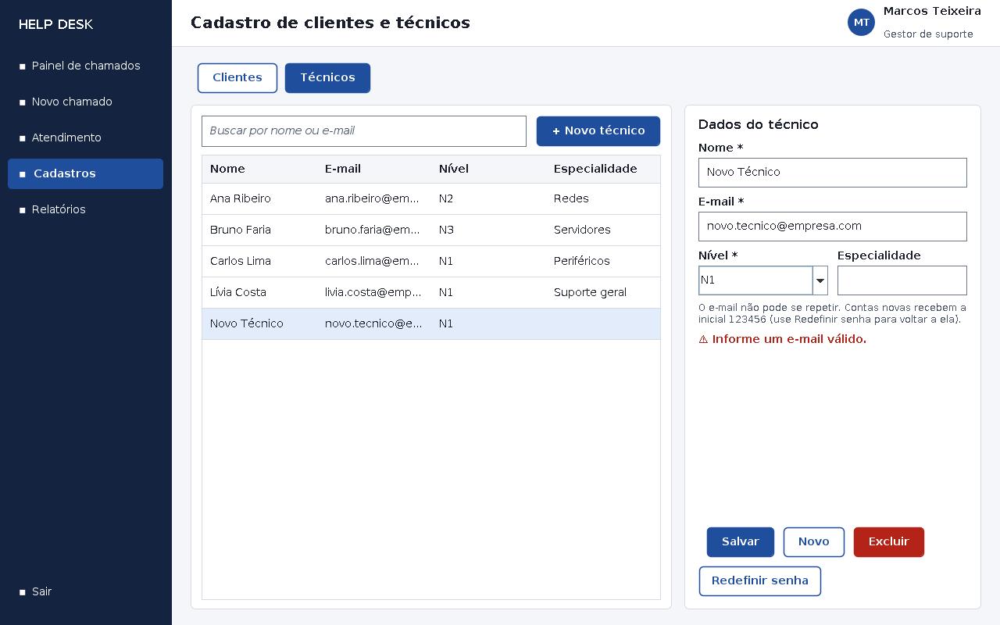
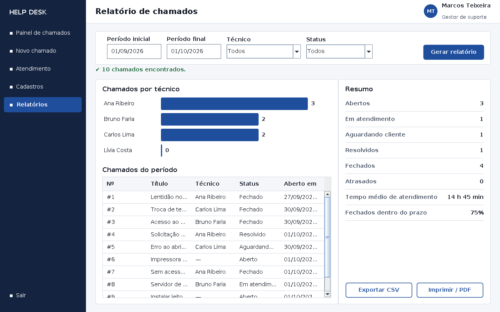

# 🛠️ Sistema de Chamados Help Desk


Sistema desktop para registrar, distribuir e acompanhar chamados de suporte técnico de uma empresa.
Projeto Integrador do curso **Técnico em Desenvolvimento de Sistemas** (Senac).

## 📌 Status do projeto

🚧 **Em desenvolvimento.** A versão atual já permite login, abertura e atendimento de chamados, cadastros e relatórios, com os dados gravados em MySQL.

| Etapa | Descrição | Situação |
|---|---|---|
| 1 | Documento de projeto, requisitos e classes | ✅ Concluída |
| 2 | Projeto de usabilidade e interfaces (UX/UI) | ✅ Concluída |
| 3 | Programação das telas e funcionalidades | ✅ Concluída |
| 4 | Banco de dados MySQL e acesso a dados (JDBC) | ✅ Concluída |
| 5 | Versionamento com Git e GitHub | ✅ Concluída |
| Próximas | Melhorias e novas funcionalidades (veja a seção *Melhorias futuras*) | 🚧 Em andamento |

## 🎯 Objetivo do software

Centralizar o atendimento de suporte técnico. Hoje, os pedidos de ajuda chegam por vários canais (telefone, mensagem, e-mail), ficam sem prioridade, sem prazo e sem histórico. O sistema deve servir para:

- permitir que o **cliente** (funcionário da empresa) abra um chamado e acompanhe o andamento;
- permitir que a equipe de **técnicos** (níveis 1, 2 e 3) atenda os chamados por prioridade, registrando cada passo até a solução;
- permitir que o **gestor** cadastre as pessoas e acompanhe prazos e desempenho por meio de relatórios.

## ⚙️ Funcionalidades do sistema (requisitos)

### Requisitos funcionais

| Código | Requisito |
|---|---|
| RF01 | Login de clientes, técnicos e gestor, com senha protegida por hash (SHA-256) |
| RF02 | Cadastrar, editar, excluir e consultar clientes e técnicos (inclui redefinir senha) |
| RF03 | O cliente abre um chamado informando título, descrição e prioridade |
| RF04 | Atribuir um técnico ao chamado, respeitando a regra RN2 |
| RF05 | Registrar interações (andamento) em um chamado |
| RF06 | Alterar o status, marcar como resolvido e fechar o chamado, respeitando as regras RN3 e RN4 |
| RF07 | Calcular o prazo limite (SLA) e sinalizar chamados atrasados |
| RF08 | Consultar chamados por texto, status, prioridade, cliente ou técnico |
| RF09 | Gerar relatório por período, técnico e status, com gráfico, resumo, exportação em CSV e impressão |

### Regras de negócio

| Código | Regra |
|---|---|
| RN1 | Todo chamado deve ter cliente, título, descrição e prioridade |
| RN2 | Chamados de prioridade alta ou crítica só podem ser atribuídos a técnicos de nível 2 ou 3 |
| RN3 | Chamado fechado não pode mais ser alterado |
| RN4 | Para fechar, o chamado deve estar resolvido e ter andamento registrado por um técnico |
| RN5 | Prazo (SLA) por prioridade: baixa 72 h, média 48 h, alta 24 h e crítica 4 h |
| RN6 | E-mail válido e único em todos os cadastros |

### Requisitos não funcionais

- Desenvolvido em Java, com interface desktop (Swing) e banco de dados MySQL.
- Interface simples, com mensagens claras de erro, atalhos de teclado e boas práticas de acessibilidade (contraste, foco visível).
- Código organizado em camadas (`model`, `dao`, `service` e `view`).

## 🧰 Tecnologias aplicadas

- **Java** (JDK 8 ou superior) e **Swing** — linguagem e interface gráfica desktop
- **NetBeans** — ambiente de desenvolvimento
- **MySQL** e **MySQL Workbench** — banco de dados relacional e modelagem
- **JDBC (MySQL Connector/J)** — acesso do Java ao banco de dados
- **UML** — diagrama de classes
- **Figma** — protótipos das telas (wireframes)
- **Git** e **GitHub** — versionamento e compartilhamento do código

## 👩‍💻 Time de desenvolvedores

| Nome | Função | GitHub |
|---|---|---|
| Kallymeire Coelho | Análise, modelagem, banco de dados e programação | [@kallymeire](https://github.com/kallymeire) |

## 🖼️ Capturas de tela

| Login | Painel de chamados |
|---|---|
|  |  |

| Atendimento do chamado | Cadastros |
|---|---|
|  |  |



## ▶️ Como executar

**Pré-requisitos:** JDK 8 ou superior, MySQL Server, MySQL Workbench e NetBeans.

1. **Clone o repositório**
   ```bash
   git clone https://github.com/kallymeire/help-desk-java.git
   ```
2. **Crie o banco de dados:** no MySQL Workbench, abra `sql/helpdesk_banco.sql` (File > Open SQL Script) e execute o script inteiro. Ele cria o banco `helpdesk`, as tabelas e os dados de teste.
3. **Configure o acesso ao banco:** copie `config/banco.properties.exemplo` para `config/banco.properties` e confira usuário e senha do seu MySQL.
4. **Abra no NetBeans:** Arquivo > Abrir Projeto > escolha a pasta do repositório. Se aparecer *referência não resolvida*, clique com o botão direito em *Libraries* > *Add Library* > **MySQL JDBC Driver** (ou adicione o `mysql-connector-j.jar` baixado do site da Oracle/MySQL).
5. **Execute** (F6). Classe principal: `br.com.helpdesk.Main`.

Sem o NetBeans (Windows): coloque o `mysql-connector-j.jar` na pasta `lib` e dê dois cliques em `executar.bat`.

### Usuários de teste (senha de todos: `123456`)

| E-mail | Perfil |
|---|---|
| gestor@empresa.com | Gestor (todas as telas) |
| ana.ribeiro@empresa.com | Técnica nível 2 |
| carlos.lima@empresa.com | Técnico nível 1 |
| maria.souza@empresa.com | Cliente (vê só os próprios chamados) |

## 🗂️ Estrutura do projeto

```
help-desk-java/
├── src/br/com/helpdesk/
│   ├── model/     # classes do domínio (Pessoa, Cliente, Tecnico, Gestor, Chamado, Interacao...)
│   ├── dao/       # acesso ao MySQL com JDBC (PessoaDAO, ChamadoDAO e implementações)
│   ├── service/   # regras de negócio (ChamadoService, CadastroService)
│   ├── view/      # telas Swing e componentes visuais
│   ├── util/      # utilitários (hash de senha)
│   └── Main.java  # ponto de entrada
├── sql/           # script do banco de dados MySQL
├── config/        # modelo de configuração do banco
├── docs/          # diagramas (UML e DER), síntese do projeto e capturas de tela
└── nbproject/     # configuração do projeto NetBeans
```

## 🔀 Fluxo de trabalho com Git

- Branch principal: `main`.
- Mensagens de commit no formato `tipo: descrição` (`feat`, `fix`, `docs`, `chore`).
- Antes de trabalhar: `git pull`. Depois de alterar: `git add`, `git commit` e `git push`.

## 🚀 Melhorias futuras

- Envio de e-mail a cada andamento do chamado
- Anexo de arquivos (prints) nos chamados
- Pesquisa de satisfação ao fechar o chamado
- Alteração de senha pelo próprio usuário
- Relatório em PDF gerado diretamente pelo sistema

## 📄 Autoria

Projeto desenvolvido por **Kallymeire Coelho** como Projeto Integrador do curso Técnico em Desenvolvimento de Sistemas.
